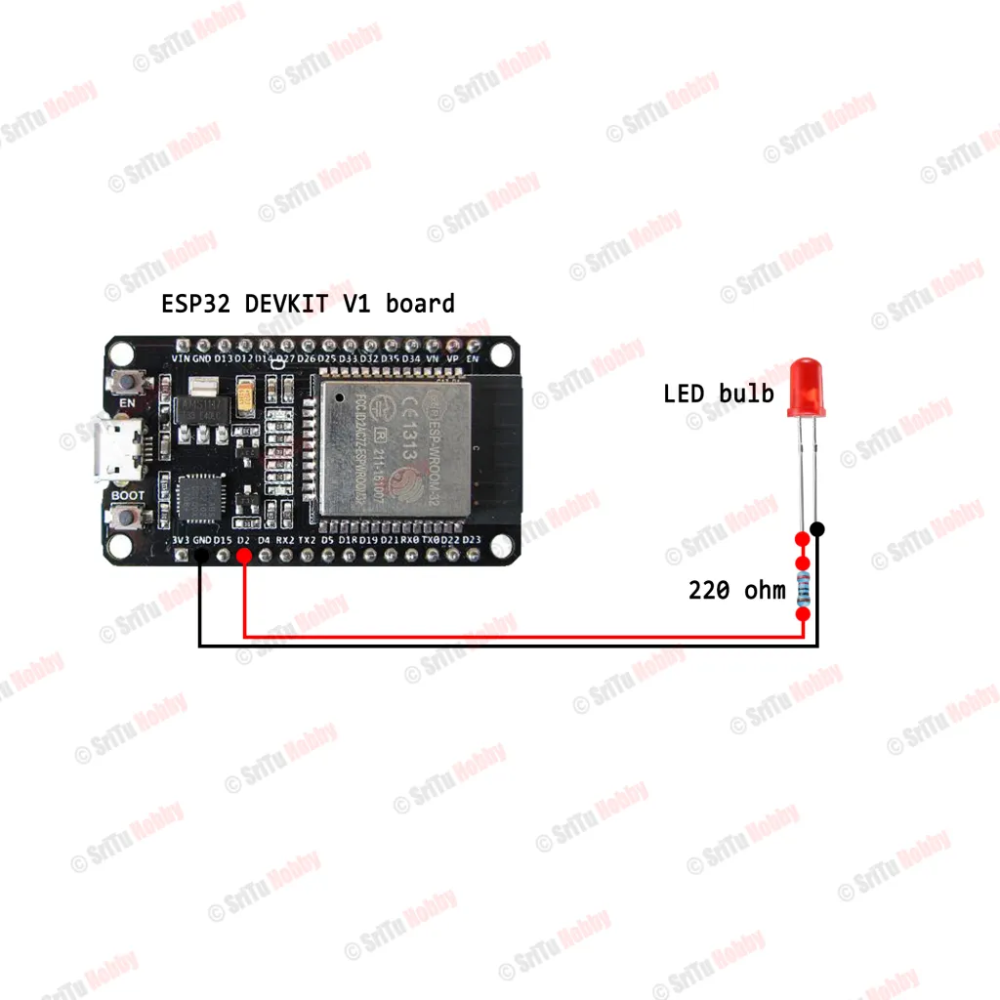

# Home Automation Sample: Control LED Lights using ESP32 with Blynk IoT App

A professional implementation of a cloud-controlled lighting system using the ESP32 microcontroller and the Blynk 2.0 platform.

## 1. Project Overview
This project demonstrates the integration of physical hardware with an IoT cloud interface. It allows for remote digital signal control (turning an LED on/off) via a smartphone or web browser.

## 2. Hardware Requirements
- ESP32 DEVKIT V1 (30 pin)
- LED bulb
- 220-ohm Resistor
- Breadboard & Jumper wires

## 3. Circuit Configuration
'`

## 4. Software Implementation
### Blynk Web Dashboard Setup
1. Create a **New Template** in [Blynk Cloud](https://blynk.cloud/) and select **ESP32** as the hardware.
2. In the **Datastreams** tab, create a new Digital Pin Datastream (assign to **GPIO 2**).
3. In the **Web Dashboard**, drag and drop a "Button" widget and map it to the Datastream.

### Mobile Application
1. Download the **Blynk IoT app** from the App Store or Play Store.
2. Log in and configure the mobile dashboard layout by adding a button widget linked to your Datastream.

``

## 5. Firmware
Ensure the **Blynk** library is installed in your Arduino IDE. Update your `main.ino` with your unique credentials.

```cpp
char auth[] = "YOUR_AUTH_TOKEN";
char ssid[] = "YOUR_WIFI_SSID";
char pass[] = "YOUR_WIFI_PASSWORD";
```

''

## 6. Acknowledgments
- Implementation guide based on the [Sritu Hobby Blynk tutorial](https://srituhobby.com/how-to-set-up-the-new-blynk-app-with-an-esp32-board/).
